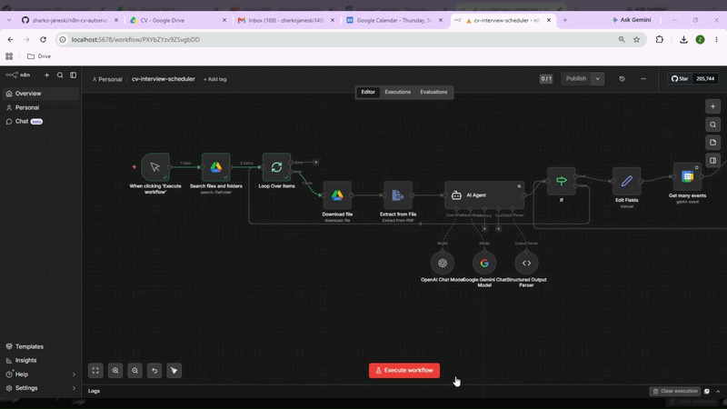
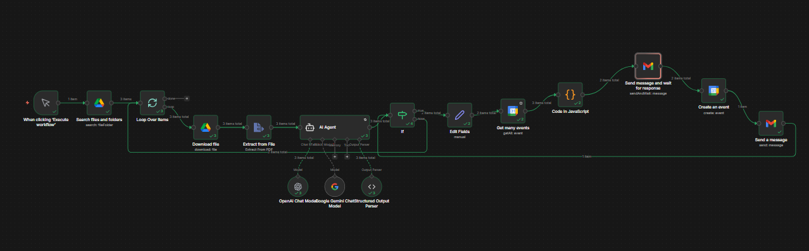
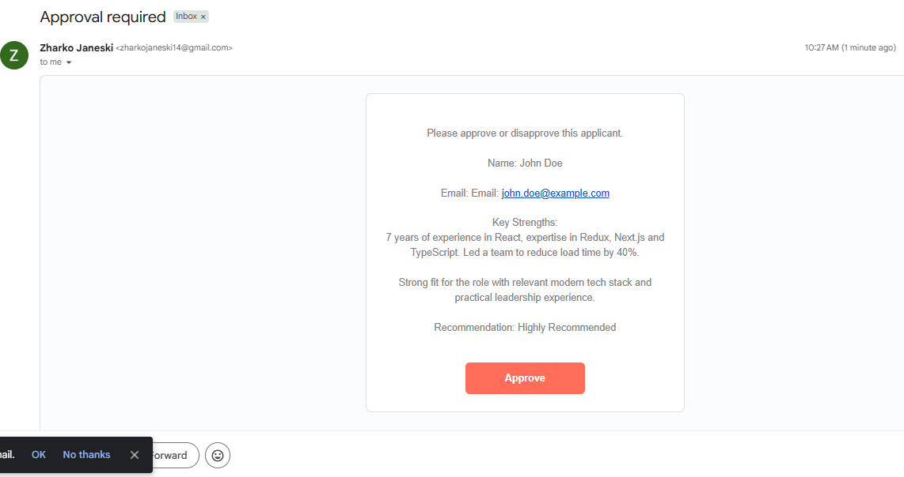
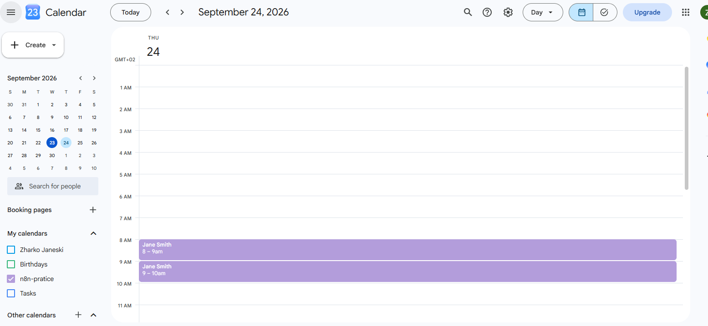
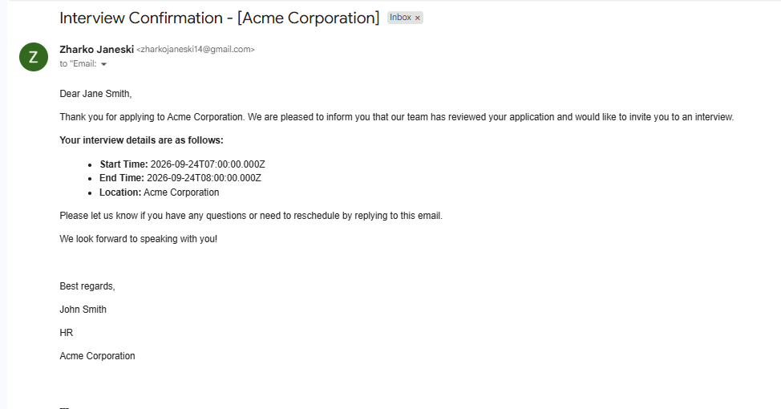

# 🤖 HR CV Interview Scheduler - n8n + Local LLM


-4D4D4D)


> Drop PDF CVs into a Drive folder → AI screens them → HR approves with one click → interviews get booked and candidates get emailed. Automatically.



## ✨ What it does

- 📂 **Scans a Google Drive folder** and processes every PDF CV, one candidate at a time
- 🧠 **AI evaluation** — a self-hosted **Qwen** model (LM Studio) reads each CV like a technical recruiter and returns structured JSON: candidate name, email, key strengths, recruiter notes, and a verdict (*Highly Recommended / Consider / Not a Fit*) — with **Google Gemini as fallback** if the local model is unreachable
- 🚫 **Auto-rejection** — candidates rated *Not a Fit* are skipped and the loop moves on to the next CV
- 📅 **Smart scheduling** — checks Google Calendar for tomorrow's availability and books the **first free hour**, skipping slots that are already taken
- ✅ **Human in the loop** — emails the full evaluation to HR and **pauses the workflow** until HR clicks *Approve* or *Reject* in Gmail
- 📆 **Books the interview** — creates a 1-hour event in Google Calendar and sends the candidate a confirmation email with the exact date and time
- 🔁 **Loops** back and repeats until every CV in the folder is processed — one click runs the whole pipeline


## ⚙️ Workflow




## 📸 In action

| ✉️ HR approval email | 📅 Auto-created event |
|:---:|:---:|
|  |  |

| 📧 Confirmation sent to the candidate |
|:---:|
|  |


## 🛠 Tech stack

| Layer | Tool |
|---|---|
| Automation | [n8n](https://n8n.io) |
| AI (primary) | **Qwen** via LM Studio — self-hosted on a separate server machine, connected through the OpenAI-compatible API |
| AI (fallback) | Google Gemini API — used automatically if the local model is unreachable |
| Integrations | Google Drive · Gmail · Google Calendar |
| Logic | n8n Code node |


## 🚀 Setup

### 1 · Import the workflow
In n8n: *Workflows → Import from File* → select `n8n-cv-interview-scheduler-ai-agent.json`

### 2 · Google Cloud project
Enable the **Drive API**, **Gmail API**, and **Calendar API**, then create OAuth2 credentials.

### 3 · Connect credentials in n8n
| Credential | Used by |
|---|---|
| Google Drive **OAuth2** | `Search files and folders` + `Download file` |
| Gmail **OAuth2** | both Gmail nodes |
| Google Calendar **OAuth2** | `Get many events` + `Create an event` |
| **Google Gemini API key** | the fallback Chat Model node |

### 4 · Local LLM (LM Studio server)
1. On the server machine, install **LM Studio** → load a **Qwen** model → start the **local server** (default port `1234`)
2. In n8n, use an **OpenAI Chat Model** node with:
   - **Base URL:** `http://YOUR_SERVER_IP:1234/v1`
   - **API key:** any placeholder
   - **Model:** the exact Qwen model name loaded in LM Studio
3. Attach the Gemini node as the **fallback** model on the AI Agent — if LM Studio is offline, Gemini answers instead

### 5 · Point it at your own data
- **Drive folder** — in `Search files and folders`, replace the query with your folder ID (it's in the folder's URL):
  ```
  'YOUR_FOLDER_ID' in parents and mimeType = 'application/pdf' and trashed = false
  ```
- **HR email** — hardcoded in `Send message and wait for response` (*Send To* field)

### 6 · Timezone
n8n *Settings → Timezone* must match your region — the slot logic computes "tomorrow 08:00–16:00" from it.

### 7 · Test it
Drop 2–3 sample PDF CVs into the folder → *Execute Workflow* → check the HR inbox → click **Approve** → watch the event appear in the calendar and the confirmation email arrive.

## ⚠️ Notes & limitations

- The approval email **hard-pauses** the workflow (*Send and Wait*) — nothing continues until HR responds
- The candidate's email is extracted from the CV text, so test CVs must contain a valid email
- If **all** of tomorrow's slots are booked, the Code node outputs `No slots available` and the Calendar node will fail — add an IF guard after the Code node to route this case gracefully
- The server machine must be running LM Studio when you execute; otherwise the agent silently falls back to Gemini


